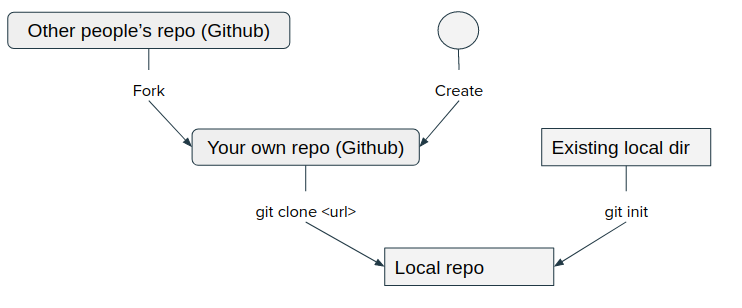

# Developer Manual

## Develop Cycle
The MCCE4 repository is at https://github.com/GunnerLab/MCCE4.

Developers are supposed to fork this repository and develop code under a branch in developer's forked repository, then submit a pull request, merge to the main repository.

### Develop cycle example:
It is encouraged to break a big project into small pieces and solve a small piece one at a time. Issues tool in Github is perfect for this purpose.

Here is an example work flow:

#### Fork the repo - one time setup
You will not push the edited code directly to the main branch of MCCE4 parent repository.
https://github.com/GunnerLab/MCCE4/fork

#### 1. Create and work on an issue 

#### 2. Write code and sync to user repo

#### 3. Submit a pull request

#### 4. Clean up
Pull from upstream main
Push to own main
Delete dev branch
Write wiki documentation

### Project monitoring
Project [MCCE4 Development Roadmap](https://github.com/orgs/GunnerLab/projects/4) monitors the MCCE4 development by the issue updates. The process is largely automated.

### Update Wiki

MCCE4 Wiki is at https://github.com/GunnerLab/MCCE4/wiki. To edit the text content, just use wiki's web editor and commit online. 

In case you need to upload pictures or other files, clone the wiki locally and put the files in the wiki repo, edit, commit, then push to github. This way, the attached files are all in one place.

### Ref - Most used git commands

## Code Organization
### Folder structure
All programs and executables are put into bin directory. Constants, data structures, classes and modules are stored under lib of bin so that they can be easily imported. Parameter sets are put under param folder. The following is an illustration:
<pre>
root
|
| -- bin -- lib -- __init__.py (list modules that can be imported)
|     |      | -- *.py (other modules)
|     | -- *.py (mcce programs and tools)
|      
| -- param -- parse -- *.ftpl (parameter files)
|     | ---- set1  -- *.ftpl (alternative parameter files)
</pre>

### Scripts command line options
Except 3rd party programs, programs and scripts in bin folder should support command line options and "-h" for help manual.

## Program and Data Structure
### Code structure

### Global Constants and Default Values

### Run options

### Protein structure

### Energy Lookup Table Structure

### Microstates Structure

## External Resources
### Python code writing style
PEP 8 style is a wildly followed style. 

The full style rules are at https://peps.python.org/pep-0008/

A nice and short explanation is at https://realpython.com/python-pep8/

### Markdown Cheatsheet
A good reference of markdown tags and examples:
[https://github.com/adam-p/markdown-here/wiki/Markdown-Cheatsheet](https://github.com/adam-p/markdown-here/wiki/Markdown-Cheatsheet)

### Python IDE

I recommend two IDEs:
* **PyCharm Community edition** from JetBrains https://www.jetbrains.com/pycharm/download 
* **Visual Studio Code** from Microsoft. https://code.visualstudio.com/

Both of them are free and support auto completion, syntax check. Visual Studio Code supports direct edit on remote locations which is useful if you write code on a ssh server or windows linux subsystem.

### Git

I have confilicting feelings with git. It is powerful and crippling at the same time. I don't remember how many times it saved me and how many times it messed up with me. 

**Self paced comprehensive tutorial:** https://learngitbranching.js.org/

**Cheatsheet:** 

**Merge Tool:**

It's inevitable you will run into conflicts when you pull from remote or merge branches when writing code with other people. When this happens, mergetool comes to rescue. Here is an example of using mergetool: https://www.rosipov.com/blog/use-vimdiff-as-git-mergetool/#fromHistor

Also it is possible to install other diff tools and configure with merge tool. On Ubuntu Linux, the default diffe tool is vimdiff, but one can reconfigure git to use a GUI diff like meld if installed.

`git config merge.tool meld`
